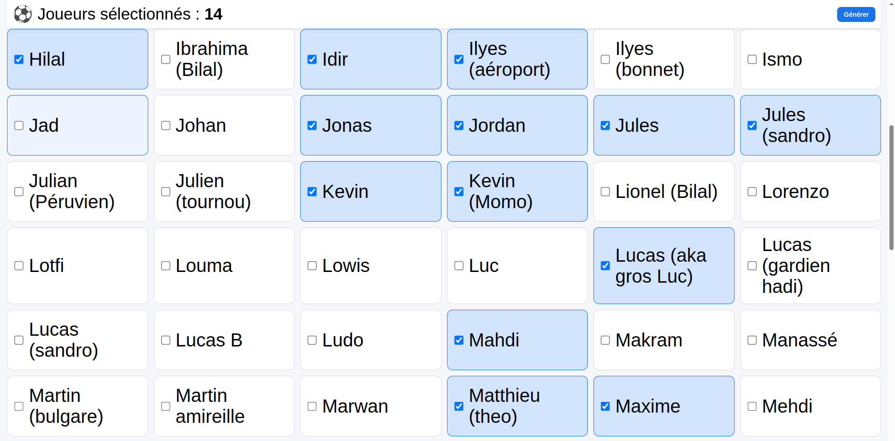
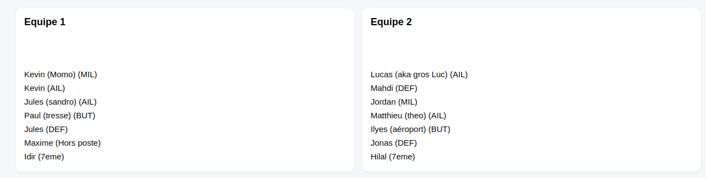
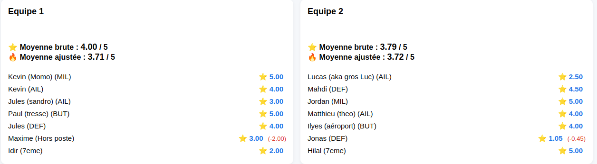

# ⚽ Football Team Generator

Generate balanced football teams directly from Google Sheets.

This project uses player ratings, preferred positions and an optimization algorithm to automatically generate the fairest teams possible.

The whole project runs on **Google Apps Script**, making it usable from both desktop and mobile without installing anything.

---

# Features

- ⚽ Automatic team generation
- 🎯 Position-aware assignment
- ⭐ Multiple preferred positions per player
- 📊 Automatic team balancing
- 👥 Support for substitutes (when the remainder fits across the complete teams)
- 🧩 Support for partial teams
- 📱 Responsive Web App
- 📈 Automatic player rating system
- 🔧 Spreadsheet auto initialization
- ➕ Player creation and editing from the Web App

---

# Screenshots







---

# How it works

Each player has:

- a rating (/5)
- up to 4 preferred position levels
- multiple playable positions per level

Example:

| Position level | Value |
|---------------|-------|
| Position1 | DEF |
| Position2 | MIL,AIL |
| Position3 | BUT |
| Position4 | |

The algorithm:

1. reads selected players
2. builds a player pool
3. generates 300 shuffled distributions, prioritizing less versatile players
4. assigns positions using the preferred-position levels and available lineup slots
5. computes the standard deviation of the teams' adjusted average ratings
6. keeps the best solution

---

# Installation

## 1. Create a Google Spreadsheet

Create a new empty spreadsheet.

---

## 2. Create an Apps Script project

Extensions → Apps Script

Create the corresponding Apps Script files and copy the contents of every file from
`src/back/` and `src/front/` into the project. Keep the HTML filenames used by
`include()` (`Index`, `Styles`, `Main`, `Player`, `Team` and `AddPlayer`).

---

## 3. Initialize the spreadsheet

From the custom menu: 
```
🛠️ Custom handling 
            Initialize sheets
```

This automatically creates:

- Players
- Notes

with all required columns, formulas and checkboxes.

---

## 4. Deploy the Web App

Deploy → New deployment

- Type: ``Web App``
- Execute as: ``Me``
- Access: ``Anyone with the link``

Copy the generated URL.

---

# Tutorial

## Add players

Fill the **Players** sheet. Each player needs a unique ID, a name, a rating and
up to four position-preference levels. The **Present** checkbox is available for
spreadsheet-side tracking; Web App selection is handled in the Web App itself.

Example:

| Id | Present | Player | Rating | Position1 | Position2 |
|----|---------|--------|------|--------|--------|
| 1 | FALSE | John | 4.5 | DEF | MIL |
| 2 | FALSE | Mike | 3.5 | AIL | BUT |

---

## Configure ratings

The **Notes** sheet lets you compute ratings automatically using weighted criteria.

You can:

- enable/disable criteria
- adjust weights
- keep using manual ratings

---

## Generate teams

Open the Web App.

Select at least 7 players.

Press ``Generate``

The application displays the generated teams and writes them to a **Teams**
sheet (replacing the previous **Teams** sheet).

## ➕ Add or edit a player

Players can be added directly from the Web App without editing the spreadsheet
manually. Existing players can also be edited from the player list.

The form asks for:

- Player name
- Level 1 position(s)
- Level 2 position(s)
- Level 3 position(s)
- Level 4 position(s)
- Manual rating, from 0.5 to 5 in 0.5-point increments

A given position can only belong to one level for the same player.

When the form is submitted:
* a new numeric and unique player ID is generated;
* a new row is added to the Players sheet;
* a matching row is added to the Notes sheet;
* formulas and boolean values are initialized automatically;
* the new player is immediately added to the Web App selection list.

Editing a player updates the corresponding rows in both **Players** and **Notes**.


---

# Rating system

Ratings can be computed automatically from customizable criteria.

Example:

- Technique
- Mental
- Pressing
- Communication
- Cold blood
- etc.

Each criterion weight can be modified directly in the spreadsheet.

---
# Position system

Each player can have up to four preference levels.

Example:

```
Position1 : DEF
Position2 : MIL,AIL
Position3 : BUT
Position4 : G
```

The algorithm applies the following coefficients to a player's rating:

| Assignment | Coefficient |
|------------|-------------|
| Position1 | 1.0 |
| Position2 | 0.9 |
| Position3 | 0.8 |
| Position4 | 0.7 |
| Out of position | 0.6 |

---

# Team balancing

Teams use a 7-player shape: `1 G, 2 DEF, 1 MIL, 2 AIL, 1 BUT`.
The generator evaluates 300 shuffled distributions.

For every generated team:

- players are assigned to the first available position in their preference order
- adjusted ratings are calculated
- the standard deviation between adjusted team averages is measured

The solution with the lowest deviation is kept.

If the remaining players can be spread across the complete teams, they become
substitutes. Otherwise, a partial team is created and virtually completed with
the median player rating for the balance calculation.

---

# Project structure

```
.
├── Images/                     # README screenshots
├── src/
│   ├── back/                   # Apps Script services and generator
│   │   ├── Main.gs
│   │   ├── player.gs
│   │   ├── playerCreationService.gs
│   │   ├── spreadsheetInitialization.gs
│   │   ├── teamDistributionService.gs
│   │   ├── teamGenerator.gs
│   │   └── utils.gs
│   └── front/                  # Web App HTML, JavaScript and styles
│       ├── AddPlayer.html
│       ├── Index.html
│       ├── Main.html
│       ├── Player.html
│       ├── Styles.html
│       └── Team.html
└── Tests/                      # Apps Script unit tests
```

---

# Why Google Sheets?

The goal of this project is to allow any group of friends to generate balanced football teams without installing any software.

Everything runs inside Google Sheets:

- free
- mobile friendly
- collaborative
- easy to customize

---

# Roadmap

- [x] Team generation from player rating
- [x] Responsive Web App
- [x] Player positioning
- [x] Unit tests
- [x] Spreadsheet initialization
- [x] Player addition and editing from the Web App
- [ ] Position re-optimization within team

---

# Contributing

Issues and Pull Requests are welcome.

---
